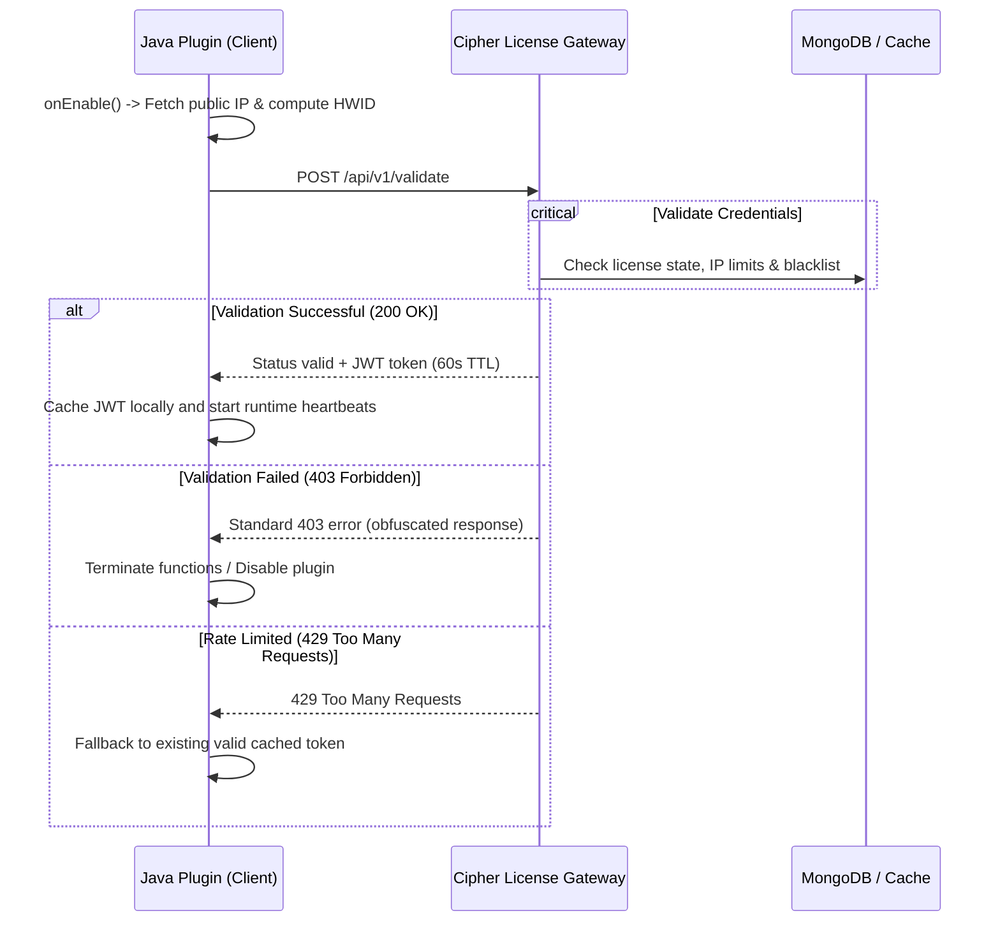

# Java Plugin Integration Guide

This guide provides a comprehensive walkthrough for integrating the **Cipher License** verification handshake into a Java-based Minecraft plugin (Spigot, Paper, Folia). It details the handshake lifecycle, complete code templates, and security hardening methodologies (like XOR string encryption and multi-stage scattered checks) to protect against decompilation and patching.

---

## 🔄 Integration Lifecycle

The handshake execution sequence happens during plugin startup (`onEnable()`) and runtime execution (via a recurring scheduler).



---

## 📦 Step 1: Hardware Identifier Utility (`HWID.java`)

Create the `HWID.java` class inside your utility package. This utility extracts unique OS parameters to identify the physical machine running the plugin. To protect privacy and prevent unauthorized database matching, the raw hardware string is compiled and hashed using **SHA-256** on the client side before transmission.

```java
package dev.cipher.license.utils;

import java.io.BufferedReader;
import java.io.InputStreamReader;
import java.net.URI;
import java.net.http.HttpClient;
import java.net.http.HttpRequest;
import java.net.http.HttpResponse;
import java.security.MessageDigest;
import java.time.Duration;
import java.util.Locale;

public class HWID {

    /**
     * Obtains the hashed hardware identification code of the host system.
     */
    public static String getHWID() {
        try {
            String rawId = resolveRawID();
            return hashString(rawId);
        } catch (Exception e) {
            // Unpredictable fallback if OS calls are locked down
            String fallback = System.getProperty("os.arch") + 
                             System.getProperty("os.name") + 
                             Runtime.getRuntime().availableProcessors();
            return hashString(fallback);
        }
    }

    /**
     * Resolves the server's public IPv4 address.
     */
    public static String getPublicIP() {
        try {
            HttpClient client = HttpClient.newBuilder()
                    .connectTimeout(Duration.ofSeconds(3))
                    .build();
            HttpRequest request = HttpRequest.newBuilder()
                    .uri(URI.create("https://api.ipify.org"))
                    .header("User-Agent", "CipherLicense-Handshake")
                    .timeout(Duration.ofSeconds(3))
                    .GET()
                    .build();
            HttpResponse<String> response = client.send(request, HttpResponse.BodyHandlers.ofString());
            if (response.statusCode() == 200) {
                return response.body().trim();
            }
        } catch (Exception ignored) {}
        return "127.0.0.1";
    }

    private static String resolveRawID() throws Exception {
        String os = System.getProperty("os.name").toLowerCase(Locale.ENGLISH);
        if (os.contains("win")) {
            return getWindowsUUID();
        } else if (os.contains("nix") || os.contains("nux") || os.contains("aix")) {
            return getLinuxUUID();
        } else if (os.contains("mac")) {
            return getMacUUID();
        }
        return "generic-hwid";
    }

    private static String getWindowsUUID() throws Exception {
        Process process = Runtime.getRuntime().exec("wmic csproduct get uuid");
        try (BufferedReader reader = new BufferedReader(new InputStreamReader(process.getInputStream()))) {
            String line;
            while ((line = reader.readLine()) != null) {
                line = line.trim();
                if (line.length() > 0 && !line.equalsIgnoreCase("uuid")) {
                    return line;
                }
            }
        }
        throw new Exception("Failed to extract Windows UUID");
    }

    private static String getLinuxUUID() throws Exception {
        Process process = Runtime.getRuntime().exec("cat /var/lib/dbus/machine-id");
        try (BufferedReader reader = new BufferedReader(new InputStreamReader(process.getInputStream()))) {
            String line = reader.readLine();
            if (line != null) return line.trim();
        }

        process = Runtime.getRuntime().exec("cat /sys/class/dmi/id/product_uuid");
        try (BufferedReader reader = new BufferedReader(new InputStreamReader(process.getInputStream()))) {
            String line = reader.readLine();
            if (line != null) return line.trim();
        }
        throw new Exception("Failed to extract Linux UUID");
    }

    private static String getMacUUID() throws Exception {
        Process process = Runtime.getRuntime().exec("system_profiler SPHardwareDataType");
        try (BufferedReader reader = new BufferedReader(new InputStreamReader(process.getInputStream()))) {
            String line;
            while ((line = reader.readLine()) != null) {
                if (line.contains("Hardware UUID")) {
                    return line.split(":")[1].trim();
                }
            }
        }
        throw new Exception("Failed to extract Mac UUID");
    }

    private static String hashString(String input) {
        try {
            MessageDigest digest = MessageDigest.getInstance("SHA-256");
            byte[] hash = digest.digest(input.getBytes("UTF-8"));
            StringBuilder hexString = new StringBuilder();
            for (byte b : hash) {
                String hex = Integer.toHexString(0xff & b);
                if (hex.length() == 1) hexString.append('0');
                hexString.append(hex);
            }
            return hexString.toString();
        } catch (Exception e) {
            throw new RuntimeException("SHA-256 hashing failed", e);
        }
    }
}
```

---

## 🔑 Step 2: License Verification Manager (`LicenseManager.java`)

The manager performs asynchronous verification using Java 11's HTTP client. It handles the local validation token (JWT), caching valid statuses for **55 seconds** (gateway expiration is 60s) to minimize network overhead on the server thread.

```java
package dev.cipher.license;

import dev.cipher.license.utils.HWID;
import com.google.gson.JsonObject;
import com.google.gson.JsonParser;
import org.bukkit.plugin.java.JavaPlugin;

import java.net.URI;
import java.net.http.HttpClient;
import java.net.http.HttpRequest;
import java.net.http.HttpResponse;
import java.time.Duration;
import java.util.concurrent.CompletableFuture;

public class LicenseManager {

    private final JavaPlugin plugin;
    private final String apiUrl;
    private final String licenseKey;
    private final String pluginId;

    private String validationToken = null;
    private long tokenExpiry = 0;

    public LicenseManager(JavaPlugin plugin, String apiUrl, String licenseKey, String pluginId) {
        this.plugin = plugin;
        this.apiUrl = apiUrl;
        this.licenseKey = licenseKey;
        this.pluginId = pluginId;
    }

    /**
     * Checks if the verification token is cached and active.
     */
    public boolean isCached() {
        return validationToken != null && System.currentTimeMillis() < tokenExpiry;
    }

    /**
     * Runs an asynchronous API call to validate the key status.
     */
    public CompletableFuture<Boolean> validate() {
        if (isCached()) {
            return CompletableFuture.completedFuture(true);
        }

        return CompletableFuture.supplyAsync(() -> {
            String hashedHwid = HWID.getHWID();
            String serverIp = HWID.getPublicIP();

            JsonObject body = new JsonObject();
            body.addProperty("licenseKey", licenseKey);
            body.addProperty("pluginId", pluginId);
            body.addProperty("serverIp", serverIp);
            body.addProperty("hwid", hashedHwid);

            try {
                HttpClient client = HttpClient.newBuilder()
                        .connectTimeout(Duration.ofSeconds(5))
                        .build();

                HttpRequest request = HttpRequest.newBuilder()
                        .uri(URI.create(apiUrl + "/api/v1/validate"))
                        .header("Content-Type", "application/json")
                        .header("User-Agent", "CipherLicense-Handshake-Java")
                        .POST(HttpRequest.BodyPublishers.ofString(body.toString()))
                        .build();

                HttpResponse<String> response = client.send(request, HttpResponse.BodyHandlers.ofString());
                int status = response.statusCode();

                if (status == 200) {
                    JsonObject res = JsonParser.parseString(response.body()).getAsJsonObject();
                    this.validationToken = res.get("token").getAsString();
                    this.tokenExpiry = System.currentTimeMillis() + 55000; // 55s cache TTL

                    if (res.has("discord")) {
                        JsonObject discord = res.getAsJsonObject("discord");
                        String ownerTag = discord.get("ownerTag").getAsString();
                        plugin.getLogger().info("[License] Verification successful. Licensed to: " + ownerTag);
                    }
                    return true;
                } else if (status == 403) {
                    plugin.getLogger().severe("[License] Handshake failed: License is suspended, revoked, or invalid.");
                    return false;
                } else if (status == 429) {
                    plugin.getLogger().warning("[License] API rate limit hit. Falling back to cached validation state.");
                    return isCached();
                }

                plugin.getLogger().severe("[License] Handshake server returned status: " + status);
                return false;
            } catch (Exception e) {
                plugin.getLogger().severe("[License] Connection exception occurred: " + e.getMessage());
                // Fallback to cache on network failures
                return isCached();
            }
        });
    }
}
```

---

## 🚀 Step 3: Boot Integration (`ExamplePlugin.java`)

Instantiate the verification manager during the `onEnable()` sequence. Execute the initial verification asynchronously to prevent blocking the main server thread.

```java
package dev.cipher.example;

import dev.cipher.license.LicenseManager;
import org.bukkit.Bukkit;
import org.bukkit.plugin.java.JavaPlugin;

public class ExamplePlugin extends JavaPlugin {

    private LicenseManager licenseManager;

    @Override
    public void onEnable() {
        saveDefaultConfig();

        String licenseKey = getConfig().getString("license-key");
        // Obfuscate this URL in production! See Step 4
        String apiUrl = "https://your-license-gateway.com";
        String pluginId = "my-plugin-slug";

        if (licenseKey == null || licenseKey.isEmpty()) {
            getLogger().severe("No license key configured. Shutting down.");
            getServer().getPluginManager().disablePlugin(this);
            return;
        }

        this.licenseManager = new LicenseManager(this, apiUrl, licenseKey, pluginId);

        // Verify asynchronously on server start
        licenseManager.validate().thenAccept(valid -> {
            if (!valid) {
                getLogger().severe("Invalid license verification. Disabling plugin features.");
                Bukkit.getScheduler().runTask(this, () -> {
                    getServer().getPluginManager().disablePlugin(this);
                });
                return;
            }
            getLogger().info("Cipher License validated. Welcome!");
        }).exceptionally(err -> {
            getLogger().severe("Unable to verify license status during boot. Disabling plugin.");
            Bukkit.getScheduler().runTask(this, () -> {
                getServer().getPluginManager().disablePlugin(this);
            });
            return null;
        });

        // Recurring scheduler task (checks status every 10 minutes)
        long interval = 12000L; // 12000 ticks = 10 minutes
        Bukkit.getScheduler().runTaskTimerAsynchronously(this, () -> {
            licenseManager.validate().thenAccept(ok -> {
                if (!ok) {
                    getLogger().severe("Runtime license validation failed. Shutting down.");
                    Bukkit.getScheduler().runTask(this, () -> {
                        getServer().getPluginManager().disablePlugin(this);
                    });
                }
            });
        }, interval, interval);
    }
}
```

---

## 🛡️ Step 4: Security Hardening & Protection Practices

Java bytecode is highly readable when decompiled (e.g. using Luyten, Recaf, or JD-GUI). To protect your verification routines from simple bypasses, use these security practices:

### 1. XOR String Obfuscation
Storing API URLs, slugs, or license keys in raw string constants allows hackers to instantly extract them via simple string scans. Use simple XOR encryption to store them as byte arrays, decrypting them at runtime.

#### XOR Encryption/Decryption Utility
```java
package dev.cipher.license.utils;

public class ObfuscationUtils {

    // Keep this secret key customized per plugin
    private static final byte[] KEY = { 0x5A, 0x3F, 0x1A, 0x7E, 0x2C, 0x4B };

    /**
     * Decrypts an XOR-encoded byte array back into a string.
     */
    public static String decrypt(byte[] encrypted) {
        byte[] decrypted = new byte[encrypted.length];
        for (int i = 0; i < encrypted.length; i++) {
            decrypted[i] = (byte) (encrypted[i] ^ KEY[i % KEY.length]);
        }
        return new String(decrypted);
    }

    /**
     * Developer Utility: Encrypts raw strings to generate obfuscated byte arrays.
     */
    public static void printEncryptedBytes(String input) {
        byte[] inputBytes = input.getBytes();
        byte[] encrypted = new byte[inputBytes.length];
        System.out.print("{ ");
        for (int i = 0; i < inputBytes.length; i++) {
            encrypted[i] = (byte) (inputBytes[i] ^ KEY[i % KEY.length]);
            System.out.printf("0x%02X", encrypted[i]);
            if (i < inputBytes.length - 1) System.out.print(", ");
        }
        System.out.println(" }");
    }
}
```
*Usage*: Instead of setting `apiUrl = "https://your-license-gateway.com"`, use `ObfuscationUtils.printEncryptedBytes("https://your-license-gateway.com")` to get the encrypted array `{ 0x30, 0x4B, 0x4E, 0x0E, 0x51, 0x77, ... }`, and define it as `private static final byte[] API_URL_ENC = { 0x30, ... }`. At runtime, fetch the decrypted string using `ObfuscationUtils.decrypt(API_URL_ENC)`.

---

### 2. Multi-Stage Scattered Checks
Do not bundle validation logic solely inside the initialization sequence or a single method. If a cracker patches your `onEnable` statement, they bypass protection entirely.
- **Hook Gameplay Listeners**: Intermittently verify the validation state inside high-frequency listeners (e.g. `PlayerJoinEvent`, custom command executions).
- **Subtle Redirection**: Instead of disabling the plugin immediately, configure the check to trigger subtle changes. For example, slowly decrease resource drop rates, cause configuration loads to fail randomly, or display minor warnings in console logs. This makes debugging and locating the license checks significantly more difficult for crackers.

---

### 3. Decompile Hardening (ProGuard Config)
When building the production JAR file, use **ProGuard** to strip trace markers and obfuscate names. Apply the following configurations inside your `proguard.cfg` or Gradle/Maven plugin settings:

```proguard
# Strip source variables and debugging information
-keepattributes !SourceFile,!LocalVariableTable,!LineNumberTable

# Obfuscate all package/class structures related to license handlers
-keep class !dev.cipher.license.** { *; }

# Keep Spigot hooks intact while scrambling internals
-keepclassmembers class * extends org.bukkit.plugin.java.JavaPlugin {
    public void onEnable();
    public void onDisable();
}
```
 Stripping the `LineNumberTable` and `LocalVariableTable` attributes makes it harder to trace the control flow using standard visual debuggers.

