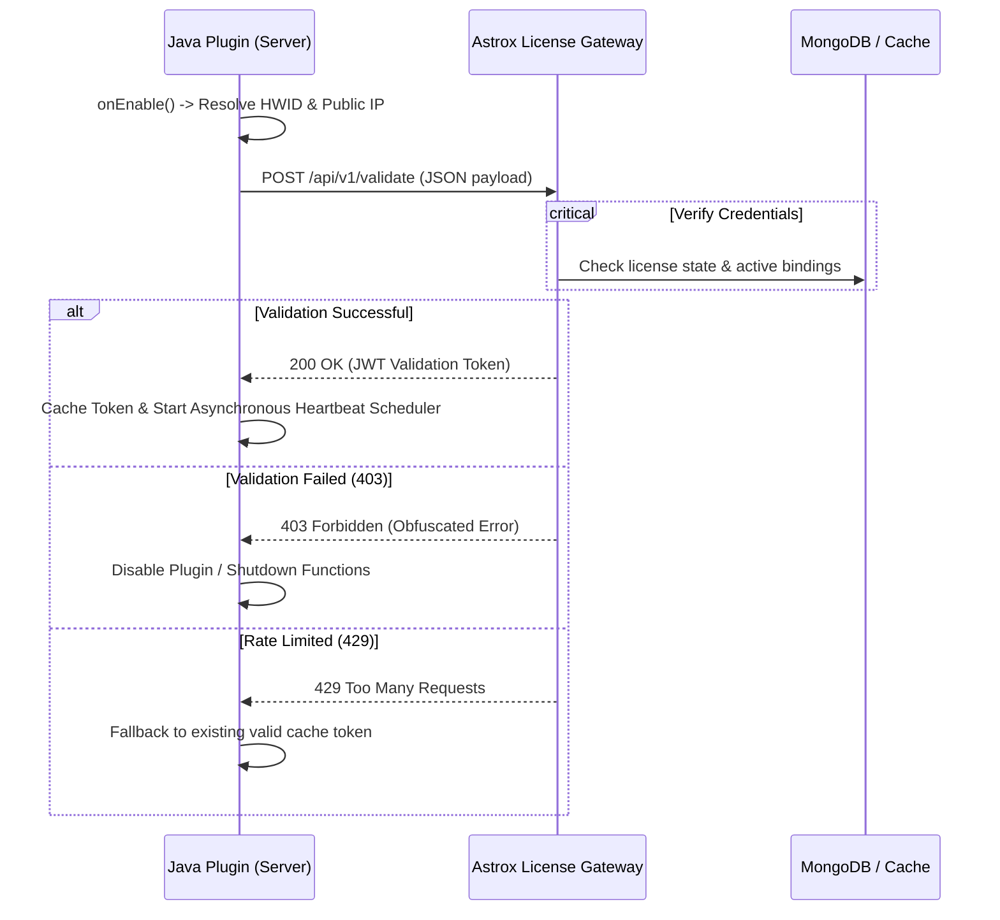

# Java Plugin Integration Guide

This guide provides a step-by-step implementation walk-through to integrate the Astrox License verification handshake into your Minecraft (Spigot, Paper, Folia) Java plugin.

---

## Integration Lifecycle Overview

The following workflow illustrates the handshake execution during plugin initialization and runtime.



---

## Step 1: Create the Hardware Identifier Utility

To tie a license to a single physical machine, create the `HWID.java` utility class under your package structure (e.g., `com.astrox.license.utils`). This utility collects OS-level UUIDs on Windows, Linux, and macOS.

```java
package com.astrox.license.utils;

import java.io.BufferedReader;
import java.io.InputStreamReader;
import java.net.URI;
import java.net.http.HttpClient;
import java.net.http.HttpRequest;
import java.net.http.HttpResponse;
import java.time.Duration;
import java.util.Locale;

public class HWID {

    /**
     * Resolves the machine's hardware ID.
     */
    public static String getHWID() {
        String os = System.getProperty("os.name").toLowerCase(Locale.ENGLISH);
        try {
            if (os.contains("win")) {
                return getWindowsUUID();
            } else if (os.contains("nix") || os.contains("nux") || os.contains("aix")) {
                return getLinuxUUID();
            } else if (os.contains("mac")) {
                return getMacUUID();
            }
        } catch (Exception e) {
            return System.getProperty("os.arch") + System.getProperty("os.name") + Runtime.getRuntime().availableProcessors();
        }
        return "unknown-hwid";
    }

    /**
     * Resolves the machine's public IPv4 address.
     */
    public static String getPublicIP() {
        try {
            HttpClient client = HttpClient.newBuilder()
                    .connectTimeout(Duration.ofSeconds(3))
                    .build();
            HttpRequest request = HttpRequest.newBuilder()
                    .uri(URI.create("https://api.ipify.org"))
                    .header("User-Agent", "AstroXLicense-Handshake")
                    .timeout(Duration.ofSeconds(3))
                    .GET()
                    .build();
            HttpResponse<String> response = client.send(request, HttpResponse.BodyHandlers.ofString());
            if (response.statusCode() == 200) {
                return response.body().trim();
            }
        } catch (Exception ignored) {}
        return "127.0.0.1"; // Fallback to localhost if resolve fails
    }

    private static String getWindowsUUID() throws Exception {
        Process process = Runtime.getRuntime().exec("wmic csproduct get uuid");
        try (BufferedReader reader = new BufferedReader(new InputStreamReader(process.getInputStream()))) {
            String line;
            while ((line = reader.readLine()) != null) {
                line = line.trim();
                if (line.length() > 0 && !line.equalsIgnoreCase("uuid")) {
                    return line;
                }
            }
        }
        throw new Exception("Failed to read Windows UUID");
    }

    private static String getLinuxUUID() throws Exception {
        Process process = Runtime.getRuntime().exec("cat /var/lib/dbus/machine-id");
        try (BufferedReader reader = new BufferedReader(new InputStreamReader(process.getInputStream()))) {
            String line = reader.readLine();
            if (line != null) return line.trim();
        }

        process = Runtime.getRuntime().exec("cat /sys/class/dmi/id/product_uuid");
        try (BufferedReader reader = new BufferedReader(new InputStreamReader(process.getInputStream()))) {
            String line = reader.readLine();
            if (line != null) return line.trim();
        }
        throw new Exception("Failed to read Linux UUID");
    }

    private static String getMacUUID() throws Exception {
        Process process = Runtime.getRuntime().exec("system_profiler SPHardwareDataType");
        try (BufferedReader reader = new BufferedReader(new InputStreamReader(process.getInputStream()))) {
            String line;
            while ((line = reader.readLine()) != null) {
                if (line.contains("Hardware UUID")) {
                    return line.split(":")[1].trim();
                }
            }
        }
        throw new Exception("Failed to read Mac UUID");
    }
}
```

---

## Step 2: Create the License Manager

Create the `LicenseManager.java` handler class. It uses Java 11's `HttpClient` to communicate asynchronously with your Astrox License dashboard, caching successful validation tokens (JWT) to limit traffic.

```java
package com.astrox.license;

import com.astrox.license.utils.HWID;
import com.google.gson.JsonObject;
import com.google.gson.JsonParser;
import org.bukkit.plugin.java.JavaPlugin;

import java.net.URI;
import java.net.http.HttpClient;
import java.net.http.HttpRequest;
import java.net.http.HttpResponse;
import java.time.Duration;
import java.util.concurrent.CompletableFuture;

public class LicenseManager {

    private final JavaPlugin plugin;
    private final String apiUrl;
    private final String licenseKey;
    private final String pluginId;

    private String validationToken = null;
    private long tokenExpiry = 0;

    public LicenseManager(JavaPlugin plugin, String apiUrl, String licenseKey, String pluginId) {
        this.plugin = plugin;
        this.apiUrl = apiUrl;
        this.licenseKey = licenseKey;
        this.pluginId = pluginId;
    }

    /**
     * Checks if the current verification token is cached and valid.
     */
    public boolean isCached() {
        return validationToken != null && System.currentTimeMillis() < tokenExpiry;
    }

    /**
     * Dispatch an asynchronous validation request.
     */
    public CompletableFuture<Boolean> validate() {
        if (isCached()) {
            return CompletableFuture.completedFuture(true);
        }

        return CompletableFuture.supplyAsync(() -> {
            String hwid = HWID.getHWID();
            String serverIp = HWID.getPublicIP();

            JsonObject body = new JsonObject();
            body.addProperty("licenseKey", licenseKey);
            body.addProperty("pluginId", pluginId);
            body.addProperty("serverIp", serverIp);
            body.addProperty("hwid", hwid);

            try {
                HttpClient client = HttpClient.newBuilder()
                        .connectTimeout(Duration.ofSeconds(5))
                        .build();

                HttpRequest request = HttpRequest.newBuilder()
                        .uri(URI.create(apiUrl + "/api/v1/validate"))
                        .header("Content-Type", "application/json")
                        .header("User-Agent", "AstroXLicense-Handshake-Java")
                        .POST(HttpRequest.BodyPublishers.ofString(body.toString()))
                        .build();

                HttpResponse<String> response = client.send(request, HttpResponse.BodyHandlers.ofString());
                int status = response.statusCode();

                if (status == 200) {
                    JsonObject resJson = JsonParser.parseString(response.body()).getAsJsonObject();
                    this.validationToken = resJson.get("token").getAsString();
                    // Cache the success for 55 seconds (TTL on gateway cache is 60s)
                    this.tokenExpiry = System.currentTimeMillis() + 55000;

                    if (resJson.has("discord")) {
                        JsonObject discordObj = resJson.getAsJsonObject("discord");
                        String ownerTag = discordObj.get("ownerTag").getAsString();
                        plugin.getLogger().info("[License] Verification successful. Licensed to: " + ownerTag);
                    }
                    return true;
                } else if (status == 403) {
                    plugin.getLogger().severe("[License] Handshake failed: License is suspended, revoked, or invalid.");
                    return false;
                } else if (status == 429) {
                    plugin.getLogger().warning("[License] Rate limit hit. Falling back to cached validation state.");
                    return isCached();
                }

                plugin.getLogger().severe("[License] Unexpected response status code: " + status);
                return false;
            } catch (Exception e) {
                plugin.getLogger().severe("[License] Error communicating with the license server: " + e.getMessage());
                // In case of a network failure, fallback to cache if available
                return isCached();
            }
        });
    }
}
```

---

## Step 3: Implement Inside Your Plugin Main Class

Integrate the manager inside your `onEnable()` function. If validation fails on startup, safely disable the plugin.

```java
package com.astrox.example;

import com.astrox.license.LicenseManager;
import org.bukkit.Bukkit;
import org.bukkit.plugin.java.JavaPlugin;

public class ExamplePlugin extends JavaPlugin {

    private LicenseManager licenseManager;

    @Override
    public void onEnable() {
        // Save default config to get license configurations
        saveDefaultConfig();

        String licenseKey = getConfig().getString("license-key");
        String apiUrl = "https://your-license-domain.com"; // Use HTTPS!
        String pluginId = "my-plugin-slug";

        if (licenseKey == null || licenseKey.isEmpty()) {
            getLogger().severe("No license key configured in config.yml. Shutting down.");
            getServer().getPluginManager().disablePlugin(this);
            return;
        }

        this.licenseManager = new LicenseManager(this, apiUrl, licenseKey, pluginId);

        // Perform initial validation asynchronously to avoid blocking the main server thread during boot
        licenseManager.validate().thenAccept(valid -> {
            if (!valid) {
                getLogger().severe("License validation failed. Shutting down plugin.");
                // Deactivation must happen on the main server thread
                Bukkit.getScheduler().runTask(this, () -> {
                    getServer().getPluginManager().disablePlugin(this);
                });
                return;
            }
            getLogger().info("License validated successfully. Thank you for your purchase!");
        }).exceptionally(err -> {
            getLogger().severe("Failed to reach verification servers during boot. Disabling.");
            // Deactivation must happen on the main server thread
            Bukkit.getScheduler().runTask(this, () -> {
                getServer().getPluginManager().disablePlugin(this);
            });
            return null;
        });

        // Start asynchronous runtime check heartbeat (e.g. check every 10 minutes)
        startHeartbeatScheduler();
    }

    private void startHeartbeatScheduler() {
        // 12000 ticks = 10 minutes
        long interval = 12000L;
        Bukkit.getScheduler().runTaskTimerAsynchronously(this, () -> {
            licenseManager.validate().thenAccept(ok -> {
                if (!ok) {
                    getLogger().severe("License check failed during execution. Disabling plugin functions.");
                    // Run disabling synchronous on main thread
                    Bukkit.getScheduler().runTask(this, () -> {
                        getServer().getPluginManager().disablePlugin(this);
                    });
                }
            });
        }, interval, interval);
    }
}
```

---

## Step 4: Apply Hardening & Bytecode Protections

Java applications can be decompiled and modified easily. Layer your security to prevent simple crack attempts:

> [!WARNING]
> **Obfuscate String Constants:**
> Do not store your API endpoints or slugs in cleartext inside compiled classes. Modders can easily use utility tools like `strings` or JD-GUI to inspect your bytecode. Compile character arrays, apply XOR encoding, or fetch them dynamically to prevent simple string scans.

### 1. Bytecode Obfuscators

Process the finished JAR file with a production obfuscator:

- **ProGuard** (Free/Open Source)
- **Zelix KlassMaster** (Commercial)

Make sure to obfuscate all class and field names within your license modules, and strip attributes such as:

- `SourceFile`
- `LocalVariableTable`
- `LineNumberTable`

### 2. Multi-Stage Checks

Scatter validation checks into critical gameplay hooks (e.g., on player join or custom events). If validation returns `false` at any stage, quietly restrict plugin behaviors rather than immediately crashing, making it harder for crackers to identify where the security triggers are located.
